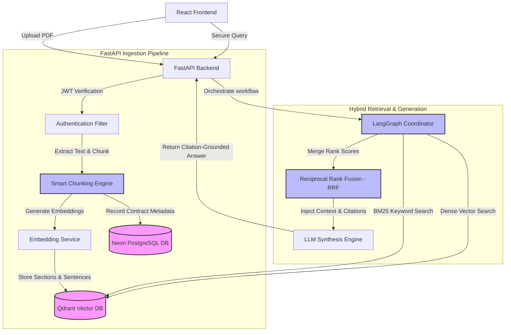

# OpenDoc

### AI-Powered Contract Intelligence Platform

OpenDoc is a citation-grounded Legal RAG platform designed for contract analysis, ownership-secured retrieval, and evidence-backed question answering.

  
  
  
  
  
  
  
  

---

## 🏗️ System Architecture

The following diagram outlines the system logic flow, from contract ingestion to hybrid retrieval execution:

---

## ✨ Feature Showcase

### 1. Hybrid Retrieval (Dense + BM25 + RRF)
*   **What it does**: Combines dense semantic vector search with keyword-based BM25 sparse search.
*   **Why it matters**: Semantic embeddings capture contextual meaning, but can miss exact codes, section numbers, or acronyms. Sparse search guarantees precision for exact identifiers.
*   **How it was implemented**: Queries are executed in parallel against Qdrant vector spaces and text indices. Results are merged and re-ranked using **Reciprocal Rank Fusion (RRF)** to construct the optimal context window for the LLM.

### 2. Multi-Tenant Ownership Enforcement
*   **What it does**: Ensures that documents, embeddings, and analytics are partitioned strictly per user.
*   **Why it matters**: Enterprise contract management requires rigid isolation. Under no circumstances can User A's queries retrieve context from User B's contracts.
*   **How it was implemented**: Row-level tenant tags are injected into embedding metadata filters within Qdrant and relational queries inside Neon Postgres, checked against signed JWT payload sub claims.

### 3. Citation Grounding & Evidence Snippets
*   **What it does**: Maps LLM generated sentences to verified agreement fragments (source sections, document names, page indices, and text block snippets).
*   **Why it matters**: Prevents hallucination. Legal analysts can click numbered citation chips directly in their query workspace to highlight and preview supporting source text.
*   **How it was implemented**: The LangGraph synthesis step maps retrieval indexes back to source metadata records. Clickable inline components in React use anchor IDs to scroll to and highlight corresponding evidence previews.

---

## 🎬 Reproducible Demonstration Script (2-3 Minutes)

Follow this predefined sequence to demonstrate the capabilities of the OpenDoc platform during reviews or portfolio presentations:

### Scenario 1: User A Contract Analysis & Citations
1.  **Authentication**: Sign in using User A credentials.
2.  **Ingestion**: Drag & drop the `Development Agreement.pdf` contract into the left **Document Repository** panel. Wait for processing to complete.
3.  **Scoped Analysis**:
    *   Select the uploaded `Development Agreement.pdf` contract in the active **Scope Selector** dropdown.
    *   Query: `What are the termination provisions?`
    *   *Inspect*: Verify the "Generated Analysis" card displays the formatted answer in clean Markdown, showing query latency (e.g. `1.8s`) and citation references. Click a citation chip (e.g., `[1]`) to scroll to and highlight the corresponding source section evidence card (e.g. "Section: Term & Termination, Page: 4").
4.  **Evidence Inspection**:
    *   Query: `Who owns the intellectual property created under this agreement?`
    *   *Inspect*: Observe citation highlights referencing intellectual property ownership sections.

### Scenario 2: Corpus-Wide Inferences
5.  **Multi-Contract Querying**:
    *   Set the **Scope Selector** back to `All Contracts (Corpus-wide)`.
    *   Query: `Compare termination provisions across my contracts.`
    *   *Inspect*: Note that OpenDoc synthesizes answers referencing multiple uploaded agreements simultaneously, displaying distinct citations for each source.

### Scenario 3: Ownership Enforcement & Corpus Isolation
6.  **Tenant B Verification**:
    *   Log out from the platform.
    *   Register/Login as **User B**.
    *   *Inspect*: Verify that User B's **Document Repository** list is completely empty. User A's uploaded contracts, vector embeddings, and search inputs are completely hidden and unreachable.
